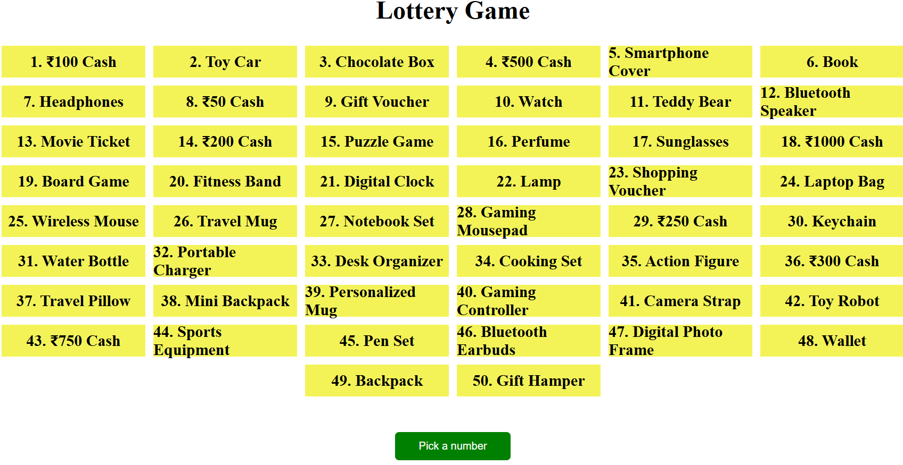

# Lottery Game 🎲

A simple web-based lottery game built using HTML, CSS, and JavaScript.  
The game allows users to interact with the UI, generate random results, and get exciting gift selections.

## Features

- User-friendly interface with responsive design
- Random gift selection using JavaScript
- Interactive and engaging game flow

## Technologies Used

- HTML – Structure of the game
- CSS – Styling and layout
- JavaScript – Game logic and randomization

## How to Play

1. Open the index.html file in your browser.
2. Interact with the game UI.
3. View the randomly generated gift results.

## Project Structure/

lottery-game-html-css-js/
│── index.html
│── style.css
│── script.js
│── README.md
│── LICENSE
│── screenshot.png

## Preview

Here’s a preview of the Lottery Game interface:

## Live Demo

👉 [Play the Game Here](https://karthik-koppera.github.io/lottery-game-html-css-js/)

## License

This project is open-source and available under the [MIT License](LICENSE).
